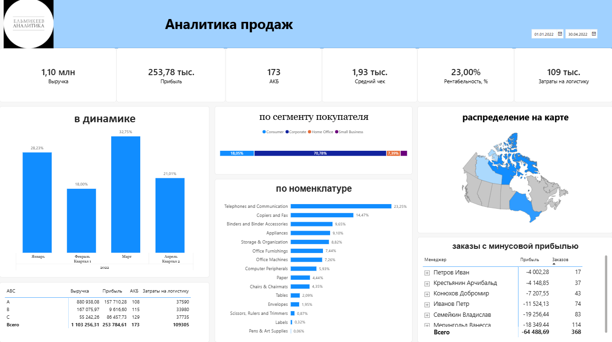

# 📊 Интерактивный дашборд продаж и логистики в Power BI

## 📌 Описание проекта
Бизнес-кейс по созданию сквозной аналитики для торгово-логистической компании. Проект включает в себя полный цикл разработки (ETL-процессы, моделирование, расчет бизнес-метрик и визуализация данных) на основе сырых выгрузок из ERP-системы.

Цель дашборда — предоставить менеджменту компании инструмент для оперативного контроля маржинальности, оценки активности клиентской базы и мониторинга затрат на доставку в режиме реального времени.

---

## 📷 Визуализация дашборда

---

## 🛠️ Стек технологий
* **Microsoft Power BI Desktop** — среда разработки отчетов и моделирования.
* **Power Query (M)** — очистка, трансфикация и консолидация данных.
* **DAX (Data Analysis Expressions)** — написание мер и расчет ключевых бизнес-показателей.
* **Microsoft Excel** — источник сырых данных.

---

## 📂 Структура репозитория
* `data/` — папка с исходным Excel-файлом (выгрузка до обработки).
* `reports/` — итоговый файл отчета в формате `.pbix` (дашборд Power BI).
* `dashboard.png` — скриншот готового дашборда (отображается выше).
* `README.md` — документация и описание проекта.

---

## 🚀 Архитектура решения и этапы реализации

### 1. Извлечение и очистка данных (ETL в Power Query)
Была проведена глубокая предобработка данных из 6 разрозненных Excel-таблиц:
* **Устранение ошибок:** Исправлены технические сбои и скрытые спецсимволы в названиях продуктов и менеджеров.
* **Типы данных:** Приведены к строгим стандартам форматы дат, текстовых полей и числовых значений.
* **Трансформация:** Настроена автоматическая цепочка очистки, которая не ломается при обновлении исходных файлов.

### 2. Моделирование данных (Data Modeling)
В Power BI Desktop спроектирована классическая реляционная модель типа **«Звезда» (Star Schema)**:
* Центральная таблица фактов: `Продажи`.
* Справочники (Dimensions): `Календарь`, `спр продукты`, `спр покупатели`, `спр менеджеры`, `спр стоимость доставки`.
* Настроены однонаправленные связи **«один ко многим» (1:*)**, что гарантирует корректную фильтрацию и исключает конфликты в расчетах.

### 3. Расчет бизнес-показателей (DAX)
Создан блок из **6 ключевых метрик**, написанных на языке DAX с использованием лучших практик оптимизации производительности:
* 💰 **Выручка Всего** — суммарный объем продаж компании.
* 📈 **Прибыль Всего** — чистый финансовый результат.
* 🚚 **Затраты на логистику** — динамический расчет стоимости доставки на основе тарифов и количества товаров (`SUMX`).
* 📊 **Рентабельность** — маржинальность бизнеса с использованием безопасного деления (`DIVIDE`).
* 👥 **АКБ** — размер Активной Клиентской Базы (подсчет уникальных покупателей через `DISTINCTCOUNT`).
* 🛒 **Средний чек** — средняя стоимость одного уникального заказа (`Order_ID`).

### 4. Визуализация и Интерактивность (Dashboard)
Интерфейс отчета разработан в соответствии с принципами бизнес-дизайна (чистый холст, отсутствие визуального шума, фокус на цифрах):
* **В динамике:** Гистограмма с накоплением, отображающая долю выручки по месяцам и кварталам в процентах (30.00%) с плотной версткой столбцов.
* **По сегментам покупателей:** 100% нормированная линейчатая диаграмма с верхней легендой, наглядно делящая продажи по типам клиентов.
* **Географический анализ:** Интерактивное распределение показателей по макрорегионам с многоуровневым дрилл-дауном (Категория ➔ Субкатегория ➔ Товар).

---

## 📈 Ключевые результаты для бизнеса
* Налажен **автоматический контроль логистических издержек**, что позволяет вовремя замечать перерасход на доставке.
* Реализована **глубокая аналитика номенклатуры**, дающая возможность в два клика спускаться от общей категории товара до конкретного артикула.
* Обеспечена **прозрачность клиентской базы**: менеджмент видит реальный вклад каждого сегмента в общую прибыль компании.

---

## 💻 Инструкция по запуску
1. Склонируйте репозиторий или скачайте файл из папки `reports/`.
2. Установите актуальную версию **Microsoft Power BI Desktop**.
3. Откройте файл `Дашборд_Продажи_М.В.Хадия.pbix`.
4. Для обновления данных укажите локальный путь к файлу из папки `data/` через настройки источников данных в Power Query.
